  
  
  

## 👋 About Me

Backend engineer at **Scenic Weather**, working where **space, sensors, and backend scaling** meet. What I build:

- 🛰️ **Space & data systems** — processing and merging planetary datasets ([Mars-Data](https://github.com/Snowda/Mars-Data)) and scalable weather backends.
- 🔌 **Embedded & sensor drivers** — low-level device drivers in Rust, from the [MPU9250 IMU](https://github.com/Snowda/MPU9250) to flash memory and accelerometers.
- ⚙️ **Backend infrastructure** — services and tooling in Rust, like [Reduction](https://github.com/Snowda/Reduction), an opinionated reverse proxy.

📍 Based in Waterloo, Ontario.

## 🛠️ Tech I Work With

<table>
  <tr>
    <td align="center" width="96"> Rust</td>
    <td align="center" width="96"> Python</td>
    <td align="center" width="96"> Postgres</td>
    <td align="center" width="96"> Linux</td>
    <td align="center" width="96"> Git</td>
    <td align="center" width="96"> React</td>
  </tr>
  <tr>
    <td align="center" width="96"> Kotlin</td>
    <td align="center" width="96"> Prometheus</td>
    <td align="center" width="96"> DigitalOcean</td>
    <td align="center" width="96"> Debian</td>
    <td align="center" width="96"> AWS</td>
  </tr>
</table>

<em>Also in the toolbox:</em>

  
  
  
  
  
  
  

## 📊 My Stats

  
  

